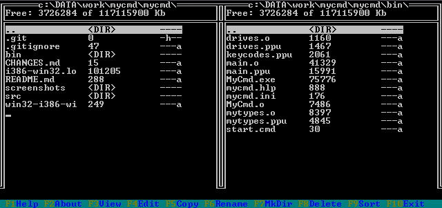

# MyCmd
Simple dual-panel DOS file manager written in Pascal.

This is my old course work from studentship times.
Application is very simple and limited, but may be useful for educational purposes. 

It's like a piece of history for me :)

## Building
### Windows:
1. Install Free Pascal: https://www.freepascal.org
2. Add path to **fpc.exe** compiler to PATH environment variable
3. Run **win32-i386-win32-build.cmd**

## Running
Run **./bin/start.cmd** to start mycmd with configuration file.